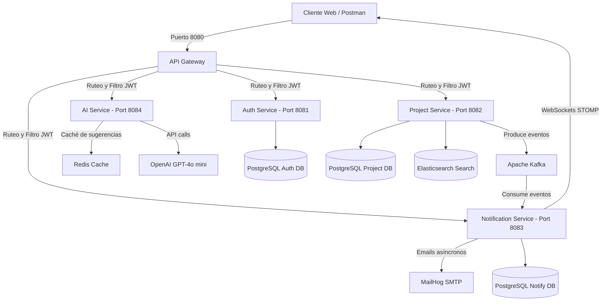

# DevFlow Backend — SaaS Project Management & AI Platform 🚀

[](https://openjdk.org/)
[](https://spring.io/projects/spring-boot)
[](https://spring.io/projects/spring-cloud)
[](https://www.docker.com/)

**DevFlow** es una plataforma SaaS de gestión de proyectos y automatización ágil de alto rendimiento. Este repositorio alberga el backend de la plataforma, estructurado en una arquitectura de **microservicios distribuidos y reactivos** construidos con **Java 21** y **Spring Boot 3**.

---

## 🏗️ Arquitectura del Sistema

El backend está diseñado como un ecosistema desacoplado que se comunica de forma sincrónica a través de REST (mediante el API Gateway) y de forma asíncrona mediante eventos utilizando **Apache Kafka**.



---

## 🛠️ Stack Tecnológico

* **Core**: Java 21 (LTS) & Spring Boot 3.2.5
* **Enrutamiento e Integridad**: Spring Cloud Gateway & Spring Security (Stateless JWT)
* **Bases de Datos Relacionales**: PostgreSQL (bases de datos independientes por microservicio)
* **Migraciones de Esquema**: Flyway Database Migrations
* **Caché y Rate Limiting**: Redis & Spring Data Redis
* **Búsqueda Avanzada**: Elasticsearch (para indexación y búsqueda rápida de tareas)
* **Mensajería Event-Driven**: Apache Kafka (desacoplamiento de creación de usuarios e hitos de tareas)
* **Notificaciones y Tiempo Real**: WebSockets con protocolo STOMP & JavaMail con plantillas Thymeleaf
* **Inteligencia Artificial**: Integración estructurada con OpenAI API (`gpt-4o-mini`)
* **Documentación**: Springdoc OpenAPI / Swagger UI
* **Contenedores**: Docker & Docker Compose

---

## 📦 Detalle de los Microservicios

### 1. [API Gateway](file:///C:/Users/fabri/OneDrive/devflow-app/devflow-backend/api-gateway) (Puerto `8080`)
Punto de entrada único. Realiza validación de tokens JWT en rutas protegidas, inyecta cabeceras downstream (`X-User-Id`, `X-User-Email`) y consolida dinámicamente las documentaciones de Swagger.

### 2. [Auth Service](file:///C:/Users/fabri/OneDrive/devflow-app/devflow-backend/auth-service) (Puerto `8081`)
Gestiona el ciclo de vida de los usuarios:
* Registro, Login tradicional y OAuth2 (Google / GitHub).
* Emisión y refresh de tokens JWT firmados digitalmente.
* Autenticación Multifactor (2FA) basada en códigos TOTP (Google Authenticator).

### 3. [Project Service](file:///C:/Users/fabri/OneDrive/devflow-app/devflow-backend/project-service) (Puerto `8082`)
El núcleo de la lógica de negocio:
* CRUD multi-inquilino de organizaciones, proyectos, boards, sprints, comentarios y tareas.
* Búsqueda difusa y a texto completo en Elasticsearch.
* Exportación de reportes (PDF, planillas Excel y códigos QR dinámicos).
* Emisión de eventos Kafka (`devflow.user.created`, `devflow.task.assigned`).

### 4. [Notification Service](file:///C:/Users/fabri/OneDrive/devflow-app/devflow-backend/notification-service) (Puerto `8083`)
Consumidor reactivo de eventos:
* Escucha Kafka y genera notificaciones instantáneas.
* Conexión persistente mediante WebSockets para alertas interactivas.
* Envío asíncrono de correos electrónicos profesionales en HTML a través de MailHog.

### 5. [AI Service](file:///C:/Users/fabri/OneDrive/devflow-app/devflow-backend/ai-service) (Puerto `8084`)
Módulo inteligente de productividad:
* Sugerencia estructurada de subtareas lógicas a partir de un título y descripción.
* Análisis de viabilidad y sobrecarga de asignaciones en Sprints.
* Caché inteligente con hashes SHA-256 en Redis para economizar tokens de OpenAI.
* Generador mock de contingencia automática si no se detecta API Key de OpenAI.

---

## 🚀 Inicio Rápido y Despliegue Local

### Requisitos previos
* **JDK 21** instalado y configurado en el `JAVA_HOME`.
* **Maven 3.8+** instalado.
* **Docker Desktop** instalado y en ejecución.

### Paso 1: Levantar la Infraestructura Local
Desde la raíz del repositorio, ejecuta Docker Compose para levantar PostgreSQL, Kafka, Zookeeper, Redis, Elasticsearch y MailHog:
```bash
docker-compose up -d
```

### Paso 2: Compilar el Proyecto
Utiliza el Wrapper de Maven o tu terminal para realizar la compilación inicial de todos los módulos:
```bash
mvn clean compile
```

### Paso 3: Arrancar los Microservicios
Inicia cada aplicación Java. Puedes hacerlo cómodamente desde tu panel de configuración en IntelliJ IDEA o mediante la línea de comandos de Maven en terminales separadas:
```bash
# Iniciar Auth Service
mvn spring-boot:run -pl auth-service

# Iniciar Project Service
mvn spring-boot:run -pl project-service

# Iniciar Notification Service
mvn spring-boot:run -pl notification-service

# Iniciar AI Service
mvn spring-boot:run -pl ai-service

# Iniciar API Gateway (Siempre al final)
mvn spring-boot:run -pl api-gateway
```

### Paso 4: Probar y Verificar
* **Swagger UI (Consolidado)**: [http://localhost:8080/swagger-ui.html](http://localhost:8080/swagger-ui.html) (usa el menú desplegable para cambiar de microservicio).
* **Buzón de Correos Local (MailHog)**: [http://localhost:8025/](http://localhost:8025/)
* **Elasticsearch**: [http://localhost:9200/](http://localhost:9200/)
* **Redis CLI**: `redis-cli -a redis123`

---

## 🔒 Variables de Entorno Clave (`.env`)
Configura tu archivo local `.env` basado en [.env.example](file:///C:/Users/fabri/OneDrive/devflow-app/devflow-backend/.env.example):
* `JWT_SECRET`: Llave de firma simétrica HMAC-SHA (mínimo 256 bits).
* `OPENAI_API_KEY`: Tu llave de OpenAI para el módulo inteligente (deja en blanco o usa `dummy-key` para usar el simulador local integrado).
